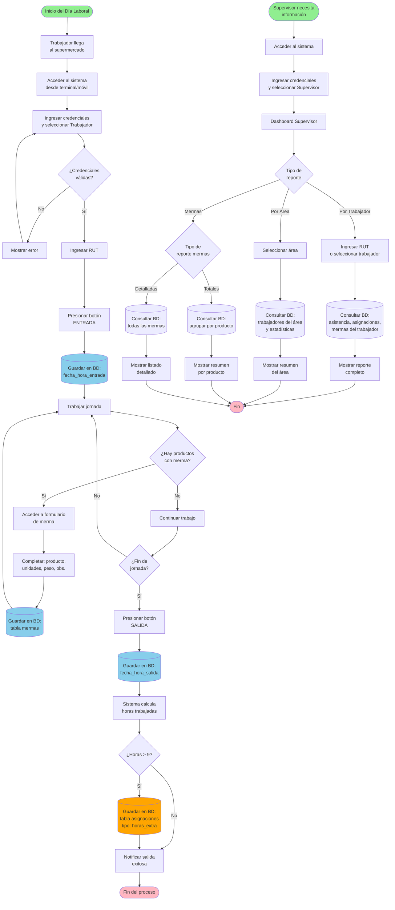

```mermaid
graph TD
    Start([Inicio del Día Laboral]) --> LlegadaTrabajador[Trabajador llega<br/>al supermercado]
    LlegadaTrabajador --> AccederSistema[Acceder al sistema<br/>desde terminal/móvil]
    AccederSistema --> Login[Ingresar credenciales<br/>y seleccionar Trabajador]
    Login --> ValidarCredenciales{¿Credenciales<br/>válidas?}
    ValidarCredenciales -->|No| ErrorCredenciales[Mostrar error]
    ErrorCredenciales --> Login
    ValidarCredenciales -->|Sí| IngresarRUT[Ingresar RUT]
    IngresarRUT --> RegistrarEntrada[Presionar botón<br/>ENTRADA]
    RegistrarEntrada --> GuardarEntrada[(Guardar en BD:<br/>fecha_hora_entrada)]
    GuardarEntrada --> TrabajarJornada[Trabajar jornada]
    
    TrabajarJornada --> VerificarMerma{¿Hay productos<br/>con merma?}
    VerificarMerma -->|Sí| RegistrarMermaProcess[Acceder a formulario<br/>de merma]
    RegistrarMermaProcess --> CompletarDatos[Completar: producto,<br/>unidades, peso, obs.]
    CompletarDatos --> GuardarMerma[(Guardar en BD:<br/>tabla mermas)]
    GuardarMerma --> TrabajarJornada
    VerificarMerma -->|No| ContinuarTrabajo[Continuar trabajo]
    
    ContinuarTrabajo --> FinJornada{¿Fin de<br/>jornada?}
    FinJornada -->|No| TrabajarJornada
    FinJornada -->|Sí| RegistrarSalidaProcess[Presionar botón<br/>SALIDA]
    RegistrarSalidaProcess --> GuardarSalida[(Guardar en BD:<br/>fecha_hora_salida)]
    GuardarSalida --> CalcularHoras[Sistema calcula<br/>horas trabajadas]
    CalcularHoras --> VerificarHorasExtra{¿Horas > 9?}
    VerificarHorasExtra -->|Sí| RegistrarHorasExtra[(Guardar en BD:<br/>tabla asignaciones<br/>tipo: horas_extra)]
    VerificarHorasExtra -->|No| NotificarSalida[Notificar salida<br/>exitosa]
    RegistrarHorasExtra --> NotificarSalida
    NotificarSalida --> End([Fin del proceso])
    
    %% Proceso paralelo de Supervisor
    StartSup([Supervisor necesita<br/>información]) --> AccederSistemaSup[Acceder al sistema]
    AccederSistemaSup --> LoginSup[Ingresar credenciales<br/>y seleccionar Supervisor]
    LoginSup --> DashboardSup[Dashboard Supervisor]
    DashboardSup --> TipoReporte{Tipo de<br/>reporte}
    TipoReporte -->|Por Trabajador| IngresarRutSup[Ingresar RUT<br/>o seleccionar trabajador]
    IngresarRutSup --> ConsultarBD1[(Consultar BD:<br/>asistencia, asignaciones,<br/>mermas del trabajador)]
    ConsultarBD1 --> MostrarReporte1[Mostrar reporte<br/>completo]
    MostrarReporte1 --> EndSup([Fin])
    
    TipoReporte -->|Por Área| SeleccionarArea[Seleccionar área]
    SeleccionarArea --> ConsultarBD2[(Consultar BD:<br/>trabajadores del área<br/>y estadísticas)]
    ConsultarBD2 --> MostrarReporte2[Mostrar resumen<br/>del área]
    MostrarReporte2 --> EndSup
    
    TipoReporte -->|Mermas| TipoMerma{Tipo de<br/>reporte mermas}
    TipoMerma -->|Totales| ConsultarBD3[(Consultar BD:<br/>agrupar por producto)]
    TipoMerma -->|Detalladas| ConsultarBD4[(Consultar BD:<br/>todas las mermas)]
    ConsultarBD3 --> MostrarReporte3[Mostrar resumen<br/>por producto]
    ConsultarBD4 --> MostrarReporte4[Mostrar listado<br/>detallado]
    MostrarReporte3 --> EndSup
    MostrarReporte4 --> EndSup
    
    style Start fill:#90EE90
    style End fill:#FFB6C1
    style StartSup fill:#90EE90
    style EndSup fill:#FFB6C1
    style GuardarEntrada fill:#87CEEB
    style GuardarSalida fill:#87CEEB
    style GuardarMerma fill:#87CEEB
    style RegistrarHorasExtra fill:#FFA500
```
