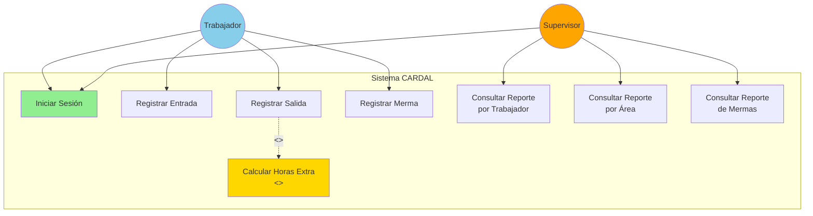

```mermaid
graph TB
    subgraph Sistema["Sistema CARDAL"]
        Login[Iniciar Sesión]
        RegistrarEntrada[Registrar Entrada]
        RegistrarSalida[Registrar Salida]
        RegistrarMerma[Registrar Merma]
        ConsultarReporteTrabajador[Consultar Reporte<br/>por Trabajador]
        ConsultarReporteArea[Consultar Reporte<br/>por Área]
        ConsultarReporteMermas[Consultar Reporte<br/>de Mermas]
        CalcularHorasExtra[Calcular Horas Extra<br/><<include>>]
    end
    
    Trabajador((Trabajador))
    Supervisor((Supervisor))
    
    Trabajador --> Login
    Supervisor --> Login
    
    Trabajador --> RegistrarEntrada
    Trabajador --> RegistrarSalida
    Trabajador --> RegistrarMerma
    
    RegistrarSalida -.->|<<include>>| CalcularHorasExtra
    
    Supervisor --> ConsultarReporteTrabajador
    Supervisor --> ConsultarReporteArea
    Supervisor --> ConsultarReporteMermas
    
    style Trabajador fill:#87CEEB
    style Supervisor fill:#FFA500
    style Login fill:#90EE90
    style CalcularHorasExtra fill:#FFD700
```
