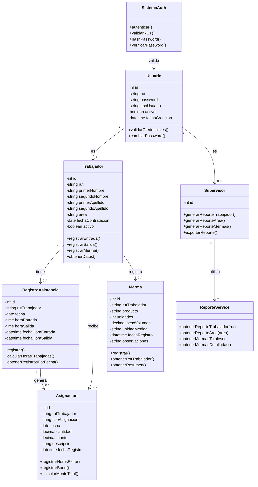

```mermaid
classDiagram
    class Usuario {
        -int id
        -string rut
        -string password
        -string tipoUsuario
        -boolean activo
        -datetime fechaCreacion
        +validarCredenciales()
        +cambiarPassword()
    }
    
    class Trabajador {
        -int id
        -string rut
        -string primerNombre
        -string segundoNombre
        -string primerApellido
        -string segundoApellido
        -string area
        -date fechaContratacion
        -boolean activo
        +registrarEntrada()
        +registrarSalida()
        +registrarMerma()
        +obtenerDatos()
    }
    
    class RegistroAsistencia {
        -int id
        -string rutTrabajador
        -date fecha
        -time horaEntrada
        -time horaSalida
        -datetime fechaHoraEntrada
        -datetime fechaHoraSalida
        +registrar()
        +calcularHorasTrabajadas()
        +obtenerRegistrosPorFecha()
    }
    
    class Asignacion {
        -int id
        -string rutTrabajador
        -string tipoAsignacion
        -date fecha
        -decimal cantidad
        -decimal monto
        -string descripcion
        -datetime fechaRegistro
        +registrarHorasExtra()
        +registrarBono()
        +calcularMontoTotal()
    }
    
    class Merma {
        -int id
        -string rutTrabajador
        -string producto
        -int unidades
        -decimal pesoVolumen
        -string unidadMedida
        -datetime fechaRegistro
        -string observaciones
        +registrar()
        +obtenerPorTrabajador()
        +obtenerResumen()
    }
    
    class Supervisor {
        -int id
        +generarReporteTrabajador()
        +generarReporteArea()
        +generarReporteMermas()
        +exportarReporte()
    }
    
    class SistemaAuth {
        +autenticar()
        +validarRUT()
        +hashPassword()
        +verificarPassword()
    }
    
    class ReporteService {
        +obtenerReporteTrabajador(rut)
        +obtenerReporteArea(area)
        +obtenerMermasTotales()
        +obtenerMermasDetalladas()
    }
    
    Usuario "1" --> "1" Trabajador : es
    Usuario "1" --> "0..1" Supervisor : es
    Trabajador "1" --> "0..*" RegistroAsistencia : tiene
    Trabajador "1" --> "0..*" Asignacion : recibe
    Trabajador "1" --> "0..*" Merma : registra
    RegistroAsistencia "1" --> "0..*" Asignacion : genera
    Supervisor "1" --> "1" ReporteService : utiliza
    SistemaAuth --> Usuario : valida
```
