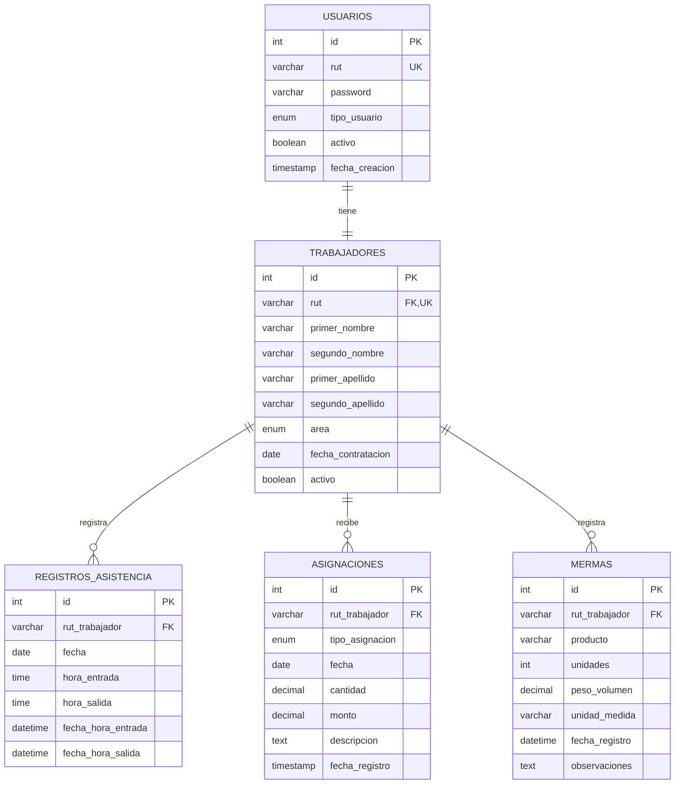

```mermaid
erDiagram
    USUARIOS ||--|| TRABAJADORES : "tiene"
    TRABAJADORES ||--o{ REGISTROS_ASISTENCIA : "registra"
    TRABAJADORES ||--o{ ASIGNACIONES : "recibe"
    TRABAJADORES ||--o{ MERMAS : "registra"
    
    USUARIOS {
        int id PK
        varchar rut UK
        varchar password
        enum tipo_usuario
        boolean activo
        timestamp fecha_creacion
    }
    
    TRABAJADORES {
        int id PK
        varchar rut FK,UK
        varchar primer_nombre
        varchar segundo_nombre
        varchar primer_apellido
        varchar segundo_apellido
        enum area
        date fecha_contratacion
        boolean activo
    }
    
    REGISTROS_ASISTENCIA {
        int id PK
        varchar rut_trabajador FK
        date fecha
        time hora_entrada
        time hora_salida
        datetime fecha_hora_entrada
        datetime fecha_hora_salida
    }
    
    ASIGNACIONES {
        int id PK
        varchar rut_trabajador FK
        enum tipo_asignacion
        date fecha
        decimal cantidad
        decimal monto
        text descripcion
        timestamp fecha_registro
    }
    
    MERMAS {
        int id PK
        varchar rut_trabajador FK
        varchar producto
        int unidades
        decimal peso_volumen
        varchar unidad_medida
        datetime fecha_registro
        text observaciones
    }
```
