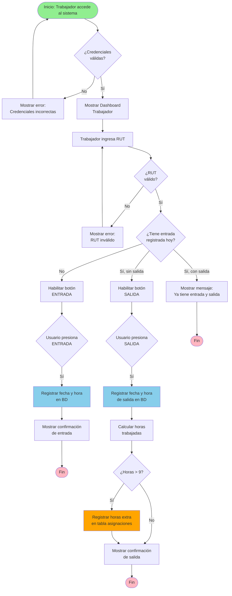

```mermaid
flowchart TD
    Start([Inicio: Trabajador accede al sistema]) --> Login{¿Credenciales<br/>válidas?}
    Login -->|No| ErrorLogin[Mostrar error:<br/>Credenciales incorrectas]
    ErrorLogin --> Start
    Login -->|Sí| Dashboard[Mostrar Dashboard<br/>Trabajador]
    Dashboard --> IngresarRUT[Trabajador ingresa RUT]
    IngresarRUT --> ValidarRUT{¿RUT<br/>válido?}
    ValidarRUT -->|No| ErrorRUT[Mostrar error:<br/>RUT inválido]
    ErrorRUT --> IngresarRUT
    ValidarRUT -->|Sí| VerificarRegistro{¿Tiene entrada<br/>registrada hoy?}
    VerificarRegistro -->|No| HabilitarEntrada[Habilitar botón<br/>ENTRADA]
    HabilitarEntrada --> PresionarEntrada{Usuario presiona<br/>ENTRADA}
    PresionarEntrada -->|Sí| RegistrarEntrada[Registrar fecha y hora<br/>en BD]
    RegistrarEntrada --> ConfirmarEntrada[Mostrar confirmación<br/>de entrada]
    ConfirmarEntrada --> Fin1([Fin])
    
    VerificarRegistro -->|Sí, sin salida| HabilitarSalida[Habilitar botón<br/>SALIDA]
    HabilitarSalida --> PresionarSalida{Usuario presiona<br/>SALIDA}
    PresionarSalida -->|Sí| RegistrarSalida[Registrar fecha y hora<br/>de salida en BD]
    RegistrarSalida --> CalcularHoras[Calcular horas<br/>trabajadas]
    CalcularHoras --> VerificarHorasExtra{¿Horas > 9?}
    VerificarHorasExtra -->|Sí| RegistrarHorasExtra[Registrar horas extra<br/>en tabla asignaciones]
    VerificarHorasExtra -->|No| ConfirmarSalida[Mostrar confirmación<br/>de salida]
    RegistrarHorasExtra --> ConfirmarSalida
    ConfirmarSalida --> Fin2([Fin])
    
    VerificarRegistro -->|Sí, con salida| YaRegistrado[Mostrar mensaje:<br/>Ya tiene entrada y salida]
    YaRegistrado --> Fin3([Fin])
    
    style Start fill:#90EE90
    style Fin1 fill:#FFB6C1
    style Fin2 fill:#FFB6C1
    style Fin3 fill:#FFB6C1
    style RegistrarHorasExtra fill:#FFA500
    style RegistrarEntrada fill:#87CEEB
    style RegistrarSalida fill:#87CEEB
```
